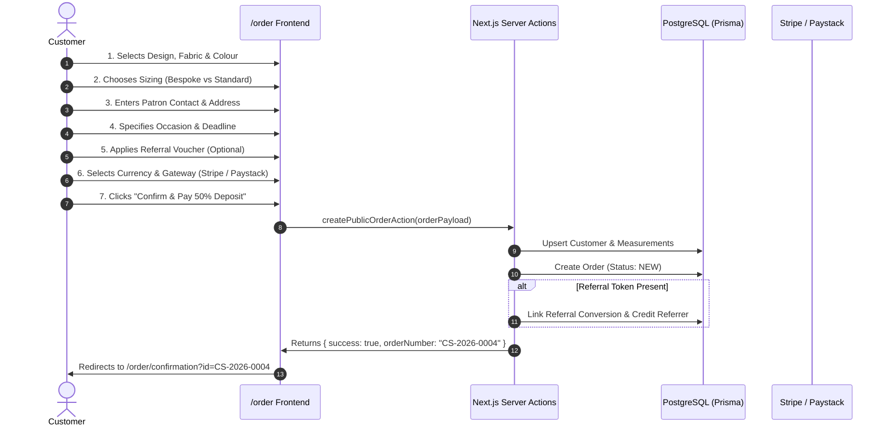

# Flow 01: Customer Bespoke Order Placement Flow

## 1. Flow Overview & Objective
This flow allows a public, unauthenticated patron (in Italy, Europe, Nigeria, or the global diaspora) to commission a bespoke garment from CaptainStitches. The user configures design attributes, inputs measurements or selects standard sizing, enters delivery details, applies referral discounts if available, and completes a 50% deposit payment.

---

## 2. Actors & Preconditions
- **Actor:** Customer / Patron (Unauthenticated).
- **Locations Supported:** Italy (and wider Europe in EUR €), Nigeria (in NGN ₦).
- **Entry Points:**
  1. **From Catalogue Page:** Clicking *"Order this piece"* on `/catalogue/[slug]` (pre-populates `?design=[slug]`).
  2. **From Referral Link:** Clicking *"Book Bespoke Commission"* on `/ref/[code]` (pre-populates `?ref=[code]` and caches token).
  3. **From Homepage Hero:** Clicking *"Order Now"* on `/` (opens blank order builder at `/order`).
  4. **Direct Navigation:** Navigating to `/order`.

---

## 3. Order Placement Variations & Methods

### Method A: Catalogue Design Selection (Standard Path)
1. User visits `/order?design=monarch-agbada`.
2. Step 1 automatically locks in the selected design (*Monarch Agbada*).
3. User selects fabric (*Presidential Cashmere*, *Super 150s Wool*, *Italian Linen*, etc.) and colour (*Midnight Black*, *Emerald Green*, *Royal Blue*, *Wine/Burgundy*).

### Method B: Custom Attire Upload (WhatsApp / Pinterest Reference)
1. User clicks the *"Custom Design Upload"* toggle in Step 1.
2. User provides a custom attire title (e.g. *"Teal Green 3-Piece Agbada with Gold Filigree"*) and specifies custom tailoring notes.
3. System applies standard bespoke base pricing (€150 / ₦220,000) with a disclaimer that final custom complexity is verified by Master Tailor Samuelson on WhatsApp.

### Method C: Referral-Discounted Checkout
1. User arrives with active referral code `?ref=DANIEL-00S` or enters `DANIEL-00S` in Step 5.
2. System calls `validateReferralCodeAction` to verify code validity.
3. Total price is immediately discounted by **€10 (or ₦10,000)**.
4. 50% deposit amount is recalculated dynamically based on discounted subtotal.

---

## 4. Detailed Step-by-Step Happy Path

### Step 1: Design & Fabrication
- User selects garment design or custom upload.
- User selects fabric grade and colourway.
- Clicks **"Next: Sizing & Measurements →"**.

### Step 2: Sizing Method & Body Dimensions
- **Option 1: Bespoke Tailoring Measurements (Recommended)**
  - Unit toggle: **Inches** or **Centimetres (CM)**.
  - Interactive visual measurement guide with highlighted anatomical focus points:
    - `Neck`, `Shoulder Width`, `Chest / Bust`, `Sleeve Length`, `Shirt / Top Length`, `Waist`, `Hips`, `Trouser Outseam Length`.
- **Option 2: Standard European / UK Sizing**
  - Size selection: `S (38)`, `M (40)`, `L (42)`, `XL (44)`, `2XL (46)`, `3XL (48)`.
  - Height category: `Short (< 5'7")`, `Regular (5'8" - 6'0")`, `Tall (> 6'0")`.
  - Body build: `Slim`, `Athletic`, `Regular`, `Broad`.
- Clicks **"Next: Delivery Details →"**.

### Step 3: Patron Details & Shipping Destination
- Fields captured:
  - `Full Name`: e.g. *Chidi Okonkwo*
  - `Email Address`: e.g. *chidi@stitches.com*
  - `Phone / WhatsApp`: e.g. *+39 340 123 4567* or *+234 814 071 5723*
  - `Delivery Address`: e.g. *Via Mazzini 14*
  - `City` & `Postal Code`: e.g. *Verona, 37121*
  - `Country`: *Italy*, *United Kingdom*, *Germany*, *Nigeria*, *Other*.
- Delivery location enum automatically mapped:
  - Italy/Europe → `DeliveryLocation.ITALY`
  - Nigeria → `DeliveryLocation.NIGERIA`
- Clicks **"Next: Occasion & Schedule →"**.

### Step 4: Event Context & Timeline
- Occasion selector: `Wedding (Groom/Guest)`, `Cultural Gala`, `Church / Thanksgiving`, `Executive Wear`, `Casual / Everyday`.
- Event Date / Deadline picker (validates against minimum 7-day turnaround).
- Special Tailoring Notes / Instructions (e.g. *"Extra room around biceps, concealed button placket"*).
- Clicks **"Next: Deposit Invoice →"**.

### Step 5: Deposit Invoice & Payment Selection
- Transparent breakdown displayed:
  - Garment Base Price (e.g. `€150.00`)
  - Applied Referral Credit (e.g. `- €10.00 [DANIEL-00S]`)
  - Adjusted Commission Total: `€140.00`
  - **50% Deposit Due Now:** `€70.00`
  - Balance Due at Final Inspection / Dispatch: `€70.00`
- Payment Gateway Toggle:
  - **Stripe (Card / Apple Pay / Google Pay):** Sets currency to `EUR €`.
  - **Paystack (Card / Bank Transfer / USSD):** Sets currency to `NGN ₦`.
- Clicks **"Confirm & Pay 50% Deposit →"**.

### Confirmation & Post-Order State
- System cleans active browser referral tokens from `localStorage`.
- Redirects to `/order/confirmation?id=CS-2026-0004&design=monarch-agbada&total=140&currency=EUR`.
- Displays:
  - Unique Order Number (`CS-2026-0004`).
  - Next steps: Workshop cutting schedule & measurement verification on WhatsApp.
  - Direct CTA to live tracking page `/track?order=CS-2026-0004`.

---

## 5. Edge Cases & Handling

| Edge Case | Scenario / Trigger | System Response & UI Behavior |
| :--- | :--- | :--- |
| **Invalid Referral Voucher** | User types a non-existent or expired code `FAKE99`. | Inline error: *"Referral code not found or expired"*. Total price remains undiscounted. |
| **Self-Referral Attempt** | User attempts to use their own referral code with matching phone/email. | Error banner: *"Self-referral is not permitted"*. Voucher is rejected. |
| **Repeat Patron Referral** | A returning customer who previously placed an order tries to use a welcome voucher. | Error: *"Referral discount is valid for first-time patron commissions only"*. |
| **Missing Mandatory Measurements** | User selects bespoke sizing but leaves `Chest` or `Shoulder` blank. | Form validation highlights missing input with gold border and scrolls to the field. |
| **Unrealistic Rush Deadline** | User enters an event date 2 days away (turnaround is 10-14 days). | Warning notice displayed informing patron that express rush slot will be confirmed via WhatsApp concierge. |
| **Switching Sizing Mode Mid-Flow** | User inputs custom numbers, switches to Standard Sizing, then back to Bespoke. | Form preserves previously entered custom measurements in component state without data loss. |
| **Phone Formatting Variations** | User enters `08031234567` or `+234 803 123 4567` or `3401234567`. | Phone normalizer cleans non-digit characters and standardizes format for CRM matching and WhatsApp deep links. |
| **Payment Gateway Disconnect** | Network drop or mock gateway timeout during checkout. | Displays clear retry banner with preserved order payload; does not create duplicate orphan orders. |

---

## 6. Database Changes & Side Effects

1. **`customers` Table:**
   - Upserts record matching customer phone/email.
   - Stores `firstName`, `lastName`, `phone`, `email`, `deliveryLocation`, and `deliveryAddress`.
2. **`measurements` Table:**
   - If bespoke mode selected, creates or updates measurement snapshot linked to `customerId`.
3. **`orders` Table:**
   - Creates new row with unique `orderNumber: "CS-2026-XXXX"`.
   - Sets `status: NEW` (or `CONFIRMED` upon payment webhook).
   - Records `totalAmount`, `depositPaid: true` (or pending), `currency`, `occasion`, `deadline`, and `measurementSnapshot` (JSON).
4. **`referrals` Table (if applicable):**
   - Sets `convertedOrderId: order.id`, `referredCustomerId: customer.id`.
   - Updates `referredRewardStatus: REDEEMED`, `referrerRewardStatus: CREDITED`.
   - Spawns fresh unassigned referral token for the referrer's next share.

---

## 7. QA / Manual Testing Checklist

- [x] **TC-01.1:** Navigate from `/catalogue` -> click *"Order this design"* -> verify design pre-fills in Step 1.
- [x] **TC-01.2:** Navigate from `/ref/DANIEL-00S` -> verify voucher `-€10` applies automatically in Step 5.
- [x] **TC-01.3:** Test Bespoke measurement inputs (inches and cm) -> ensure inputs accept decimals (e.g. `42.5`).
- [x] **TC-01.4:** Test Standard sizing mode -> select `L (42)`, `Regular height`, `Athletic build` -> submit order.
- [x] **TC-01.5:** Test custom reference upload toggle -> enter custom title and notes -> verify submission.
- [x] **TC-01.6:** Switch between Stripe (EUR) and Paystack (NGN) -> verify total & deposit recalculate correctly.
- [x] **TC-01.7:** Confirm order -> verify redirection to `/order/confirmation` with correct order number.
- [x] **TC-01.8:** Check database via Prisma or Admin -> verify order, customer, measurements, and referral conversion are persisted.
