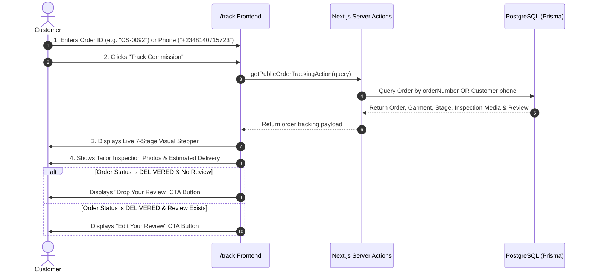

# Flow 02: Customer Order Tracking Flow

## 1. Flow Overview & Objective
This flow enables an unauthenticated patron to check real-time workshop progress, estimated delivery timeline, master inspection media, balance payment status, and review triggers by entering either their **Order ID** (e.g. `CS-2026-0001` or `CS-0092`) or **Registered Phone Number**.

---

## 2. Actors & Preconditions
- **Actor:** Customer / Patron (Unauthenticated).
- **Entry Points:**
  1. Navigation Header: Clicking **"Track Order"** (`/track`).
  2. Confirmation Page link: `/track?order=CS-2026-0004`.
  3. Direct Link in SMS / WhatsApp: `/track?order=CS-0092` or `/track/CS-0092`.

---

## 3. Detailed Step-by-Step Happy Path

### Step 1: Inputting Search Query
- User visits `/track`.
- Input accepts:
  - Order Number: e.g. `CS-0092` or `cs-0092` (case-insensitive).
  - Phone Number: e.g. `08140715723`, `+2348140715723`, or `+39 340 1234567`.
- Quick-sample buttons allow one-click testing of live database orders.

### Step 2: Live Workshop Progress Stepper
Upon match, the page renders a 7-stage obsidian/gold progress bar:
1. **Commission Received (`NEW`):** Fabric selected, booking logged.
2. **Deposit Confirmed (`CONFIRMED`):** 50% deposit received, fabric queued in cutting room.
3. **In Production (`IN_PRODUCTION`):** Master artisan hand-stitching in Nigeria workshop.
4. **Final Inspection (`INSPECTION`):** Garment completed; high-definition video/photos submitted.
5. **Quality Approved (`APPROVED`):** Samuelson personally signed off on seams & embroidery.
6. **Dispatched / In Transit (`DISPATCHED`):** Secure courier in transit to Italy / Nigeria address.
7. **Delivered (`DELIVERED`):** Garment received by customer.

### Step 3: Order Details & Inspection Artifacts
- Garment Card: Photo, Design Name (e.g. *Teal Green 3-Piece Agbada*), Sizing details.
- Destination Card: Delivery City, Country flag (🇮🇹 Italy / 🇳🇬 Nigeria), and Estimated Delivery Date.
- **Workshop Inspection Media:**
  - If Master Tailor uploaded inspection images/videos during `INSPECTION` or `APPROVED`, a carousel renders high-resolution photos showing seam finishes and embroidery precision.
- **Payment & Balance Summary:**
  - 50% Deposit Paid indicator.
  - Remaining Balance status. If balance is pending prior to dispatch, a direct balance payment link is presented.

### Step 4: Post-Delivery Engagement & Review Integration
- When order status reaches **`DELIVERED`**:
  - If no review exists: Prominent button **"Leave a Review on this Attire →"** links to `/review?order=CS-0092`.
  - If a review was already submitted: Button **"Edit Your Review (★ 5/5) ✎"** links to `/review?order=CS-0092` with pre-populated comment and star rating.

---

## 4. Edge Cases & Handling

| Edge Case | Scenario / Trigger | System Response & UI Behavior |
| :--- | :--- | :--- |
| **Non-Existent Order Number** | User enters `CS-999999` or typos code. | Displays friendly error: *"No order found matching CS-999999. Please double check your order number or phone number."* Form remains populated for easy editing. |
| **Phone Number Matching Multiple Orders** | Customer has placed 3 orders over 6 months and searches by phone. | System returns the most recent active order or presents a selection drawer allowing the user to pick which commission to inspect. |
| **Case Sensitivity & Spaces** | User inputs ` cs-0092 ` with lowercase and whitespace. | Query normalizer strips whitespace and uppercases input to match database `CS-0092`. |
| **No Inspection Media Uploaded Yet** | Order is in `IN_PRODUCTION` before tailor uploads inspection photos. | Inspection gallery displays an elegant placeholder: *"Workshop inspection photos will appear here once the garment reaches the final quality check."* |
| **International Phone Formatting** | User searches with `0814...` instead of `+234814...`. | Clean digit matcher indexes the last 7–10 digits to guarantee matches across international formats. |

---

## 5. Database Queries & Relations

- **Queried Model:** `prisma.order.findFirst(...)`
  - Includes: `customer`, `design`, `design.photos`, `reviews` (matching `orderId`).
- **Read Attributes:** `orderNumber`, `status`, `deliveryLocation`, `deliveryAddress`, `estimatedDelivery`, `depositPaid`, `balancePaid`, `inspectionPhotos`, `createdAt`, `updatedAt`.

---

## 6. QA / Manual Testing Checklist

- [x] **TC-02.1:** Navigate to `/track` without query params -> verify empty state with search input.
- [x] **TC-02.2:** Search by Order ID `CS-0092` -> verify stepper loads at correct stage.
- [x] **TC-02.3:** Search by registered Phone `+2348140715723` -> verify matching order loads.
- [x] **TC-02.4:** Direct URL access `/track?order=CS-0092` -> verify auto-lookup executes on page load.
- [x] **TC-02.5:** Check an order in `DELIVERED` state -> verify *"Leave a Review"* or *"Edit Your Review"* button appears.
- [x] **TC-02.6:** Click *"Inquire on WhatsApp"* -> verify WhatsApp opens with pre-filled message containing the order number.
- [x] **TC-02.7:** Search invalid order ID `CS-0000` -> verify clear error message without page crash.
