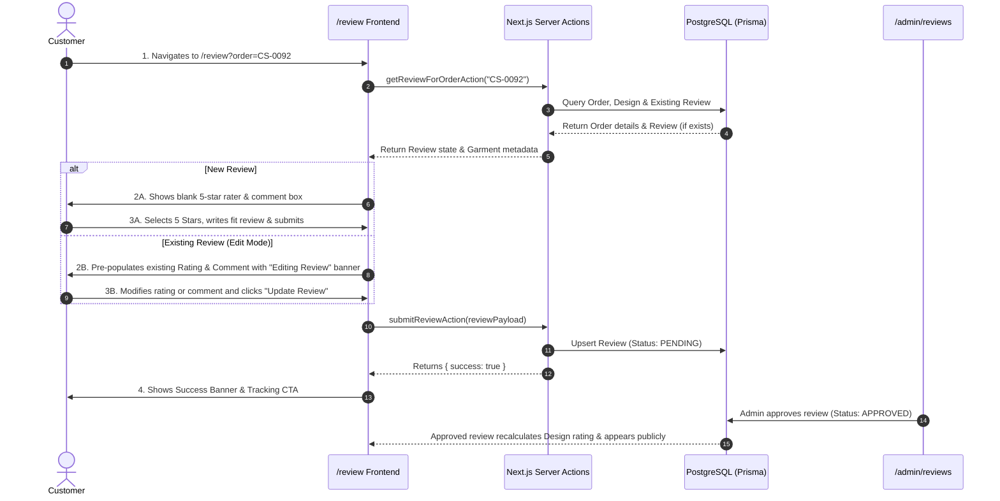

# Flow 03: Customer Review & Rating Flow

## 1. Flow Overview & Objective
This flow allows an unauthenticated patron who has received their bespoke attire to submit a verified rating, fit evaluation, and photo feedback. If a review has already been submitted for the order, the patron can view and edit their review. Submitted reviews enter an administrative moderation queue before publishing.

---

## 2. Actors & Preconditions
- **Actor:** Customer / Patron (Unauthenticated).
- **Precondition:** The customer must have a valid order in the system (ideally in `DELIVERED` status).
- **Entry Points:**
  1. From `/track` page: Clicking **"Drop Your Review"** or **"Edit Your Review"**.
  2. Direct Link via Post-Delivery WhatsApp / Email: `/review?order=CS-0092`.
  3. Direct Navigation: `/review`.

---

## 3. Detailed Step-by-Step Happy Path

### Path A: First-Time Review Submission
1. Patron visits `/review?order=CS-0092`.
2. System loads order information: *Teal Green Agbada (Commission CS-0092)*.
3. Interactive 5-star rating selector: Patron clicks 1, 2, 3, 4, or 5 stars (with visual gold hover animation).
4. Reviewer details:
   - Full Name (pre-filled from customer record: e.g. *Daniel Nwokocha*).
   - Location (e.g. *Verona, Italy* or *Lagos, Nigeria*).
5. Written Review / Fit Critique:
   - Form prompts: *Fabric feel, embroidery detail, sleeve fit, promptness of delivery*.
6. Photo Uploads (Optional): Uploading photos of the patron wearing the bespoke piece at their event.
7. Clicks **"Submit Verified Review →"**.
8. System saves review to PostgreSQL with `status: PENDING`.
9. Success card displays: *"Thank you, Daniel! Your review has been received and will appear on the lookbook once verified by our master tailor."*

### Path B: Editing an Existing Review
1. Patron returns to `/review?order=CS-0092` or clicks *"Edit Your Review"* from `/track`.
2. System detects existing review in database (`Review.orderId === order.id`).
3. UI switches to **Edit Mode**:
   - Header displays: *"Editing Your Review for Order CS-0092"*.
   - Star rating pre-selects previously submitted value (e.g. `5 Stars`).
   - Textarea pre-fills with previous comment.
4. Patron modifies their feedback and clicks **"Update Review →"**.
5. Server action updates the existing row in `reviews` table and resets status to `PENDING` for re-verification.
6. Success feedback confirms updated submission.

---

## 4. Edge Cases & Handling

| Edge Case | Scenario / Trigger | System Response & UI Behavior |
| :--- | :--- | :--- |
| **Order Not Yet Delivered** | Customer opens `/review?order=CS-0004` while order is still in `IN_PRODUCTION`. | Displays an informative notice: *"Your attire is currently being crafted in our workshop. You will be able to review the piece once delivered."* Allows previewing the form. |
| **Non-Existent Order ID** | User enters `CS-XXXX` on `/review`. | Shows error: *"Order CS-XXXX could not be found. Please check your order confirmation code."* |
| **Empty Rating or 0 Stars** | User attempts to submit without clicking a star. | Form highlights star rater in amber and prevents submission until rating (1-5) is selected. |
| **Profanity or Spam Submission** | Inappropriate language in review body. | Server moderation pipeline flags review; review remains `PENDING` and is blocked from public catalogue until admin explicitly approves. |
| **Multiple Submissions for Same Order** | User clicks submit multiple times in rapid succession. | Button disables on first click with spinner; backend uses `upsert` on `orderId` to prevent duplicate review creation. |

---

## 5. Database Changes & Moderation Flow

1. **`reviews` Table:**
   - Fields: `id`, `customerId`, `orderId`, `designId`, `rating` (1-5), `comment`, `photoUrls`, `status: PENDING | APPROVED | REJECTED`, `createdAt`, `updatedAt`.
2. **Post-Moderation (`APPROVED` by Samuelson):**
   - Design's average star rating is recalculated: $\text{Rating} = \frac{\sum \text{approved stars}}{\text{approved count}}$.
   - Approved review displays in public lookbook `/catalogue/[slug]` and eligible for Homepage Testimonial feed.

---

## 6. QA / Manual Testing Checklist

- [x] **TC-03.1:** Open `/review?order=CS-0092` -> verify garment name and customer details load.
- [x] **TC-03.2:** Select 5 stars, write feedback, submit -> verify success state.
- [x] **TC-03.3:** Re-open `/review?order=CS-0092` -> verify edit mode activates with pre-filled content.
- [x] **TC-03.4:** Update star rating from 5 to 4 -> click Update -> verify DB record updates with status `PENDING`.
- [x] **TC-03.5:** Verify `/track?order=CS-0092` now displays *"Edit Your Review (★ 4/5)"*.
- [x] **TC-03.6:** Test validation by attempting to submit with empty comment text.
- [x] **TC-03.7:** Open `/admin/reviews` -> verify new/updated review appears in the moderation queue.
