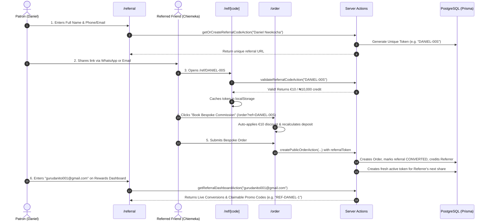

# Flow 04: Customer Referral & Ambassador Programme Flow

## 1. Flow Overview & Objective
This flow manages the end-to-end patronage referral loop. Existing patrons and diaspora ambassadors can generate personalized invitation links, share them via WhatsApp or email, allow invited friends across Europe/Nigeria to claim a **€10 / ₦10,000 welcome credit**, and track their earned rewards (*10% tailoring vouchers, priority rush slots, custom embroidered caps*) in their live patron dashboard.

---

## 2. Actors & Preconditions
- **Actors:**
  - **Referrer:** Existing patron or diaspora ambassador.
  - **Referred Friend:** New patron placing their first commission.
- **Entry Points:**
  - Referral Hub: [`/referral`](file:///Users/danielnwokocha/Documents/projects/captain-stitches/src/app/referral/page.tsx).
  - Invitation Landing: [`/ref/[code]`](file:///Users/danielnwokocha/Documents/projects/captain-stitches/src/app/ref/%5Bcode%5D/page.tsx).
  - Order Checkout: [`/order`](file:///Users/danielnwokocha/Documents/projects/captain-stitches/src/app/order/page.tsx).

---

## 3. Milestone Reward Tiers

| Tier | Conversions | Referrer Reward | Referred Friend Benefit |
| :--- | :--- | :--- | :--- |
| **Tier 01** | **1 Friend** | **10% Discount Code** for next commission | **€10 / ₦10,000 Off** deposit |
| **Tier 02** | **3 Friends** | **Priority Rush Slot** (halves production timeline) + **Matching Embroidered Native Cap** | **€10 / ₦10,000 Off** deposit |
| **Tier 03** | **5+ Friends** | **VIP Sovereign Patron** (15% Lifetime Discount + Free Monogram Embroidery) | **€10 / ₦10,000 Off** deposit |

---

## 4. Detailed Step-by-Step Happy Path

### Phase 1: Link Generation (Referrer)
1. Patron visits `/referral`.
2. In the **Generate Custom Referral Link** section, enters their name (e.g. *Daniel Nwokocha*) and contact info.
3. System checks for existing customer record or registers an ambassador profile.
4. Generates unique collision-free token (e.g. `DANIEL-00S`).
5. Generates bespoke URL: `http://localhost:3000/ref/DANIEL-00S`.
6. Patron clicks **"Copy"**, **"WhatsApp"**, or **"Email"** to share with their diaspora network.

### Phase 2: Landing & Voucher Activation (Friend)
1. Friend clicks the shared link and lands on `/ref/DANIEL-00S`.
2. Landing page verifies token with server:
   - Displays: *"Personal Atelier Invitation — €10 / ₦10,000 Welcome Voucher gifted by Daniel N."*
   - Status badge: `DANIEL-00S ✓ ACTIVATED`.
3. Friend clicks **"Book Bespoke Commission →"** (routes to `/order?ref=DANIEL-00S`).

### Phase 3: Checkout Conversion & Reward Crediting
1. On `/order`, the referral code `DANIEL-00S` is auto-detected.
2. In Step 5 (Deposit Invoice), the voucher is displayed with a green checkmark:
   - Base Price: `€150.00`
   - Referral Discount: `- €10.00`
   - Total: `€140.00`
   - **50% Deposit Due:** `€70.00`
3. Friend submits order.
4. Server records conversion in PostgreSQL:
   - Links `referredCustomerId` and `convertedOrderId`.
   - Sets `referredRewardStatus = REDEEMED`.
   - Sets `referrerRewardStatus = CREDITED`.
   - Automatically generates a new shareable token for Daniel's next referral.

### Phase 4: Tracking & Voucher Redemption (Referrer)
1. Referrer visits `/referral` -> enters `gurudanito001@gmail.com` in **Patron Rewards Dashboard**.
2. Dashboard renders live statistics:
   - **Introduced:** `3`
   - **Conversions:** `2`
   - **Active Vouchers:** `2`
   - **Reward History & Codes:**
     - *10% Commission Voucher* (Friend: Chiemeka E.) -> Code: `REF-DANIEL-1` `[CLAIMABLE]`
     - *10% Commission Voucher* (Friend: Chiemeka E.) -> Code: `REF-DANIEL-2` `[CLAIMABLE]`
3. Referrer can copy voucher codes to apply on their next bespoke order.

---

## 5. Edge Cases & Handling

| Edge Case | Scenario / Trigger | System Response & UI Behavior |
| :--- | :--- | :--- |
| **Self-Referral** | Referrer opens their own link and tries to checkout with their own phone/email. | Validation blocks order conversion with error: *"Self-referral is not permitted"*. |
| **Non-First-Time Customer** | A patron who already has an order in the database attempts to use a welcome voucher. | Order checkout rejects voucher: *"Referral discount is valid for first-time patron commissions only"*. Order proceeds at standard price. |
| **Non-Existent Referral Code** | Friend visits `/ref/INVALIDCODE99`. | Landing page shows notice: *"Referral code not found or expired"*. Provides direct button to continue to standard catalogue. |
| **Token Suffix Collision** | Multiple referrers with identical names (e.g. two *Daniel*s). | System appends customer ID hash or randomized alphanumeric suffix (e.g. `DANIEL-00S`, `DANIEL-7B2`, `DANIEL-9MG0`) guaranteeing unique tokens. |
| **Referrer Without Orders Yet** | Prospective ambassador generates a link before ever placing an order. | Allowed! Ambassador customer record is created on-the-fly and token generated immediately. |
| **Programme Paused by Admin** | Admin pauses referral programme in `/admin/referrals`. | Existing links continue to open lookbook, but new discounts and rewards are temporarily paused with polite notification. |

---

## 6. Database Changes & Tracking

1. **`referrals` Table:**
   - Active Share Row: `referrerId`, `token: "DANIEL-00S"`, `convertedOrderId: null`, `referrerRewardStatus: PENDING`.
   - Converted Row: `referrerId`, `token: "DANIEL-00S"`, `referredCustomerId: cust_123`, `convertedOrderId: ord_456`, `referrerRewardStatus: CREDITED`, `referredRewardStatus: REDEEMED`.
2. **Admin Aggregation:**
   - `/admin/referrals` calculates live conversion rate: $\frac{\text{Converted}}{\text{Generated}} \times 100\%$.
   - Live Leaderboard ranks top referrers by conversion count.

---

## 7. QA / Manual Testing Checklist

- [x] **TC-04.1:** Visit `/referral` -> generate link for "Samuel Anaele" -> verify link `http://localhost:3000/ref/SAMUEL10`.
- [x] **TC-04.2:** Click *"Copy"* and *"WhatsApp"* -> verify clipboard and WhatsApp share text.
- [x] **TC-04.3:** Open generated link `/ref/SAMUEL10` in browser -> verify welcome voucher card with €10 / ₦10,000 credit.
- [x] **TC-04.4:** Click *"Book Bespoke Commission"* -> verify `/order?ref=SAMUEL10` loads with -€10 discount applied in Step 5.
- [x] **TC-04.5:** Complete order checkout -> verify order number generated.
- [x] **TC-04.6:** Check `/referral` dashboard with referrer email -> verify conversion count incremented and claimable promo code appears.
- [x] **TC-04.7:** Check `/admin/referrals` -> verify top referrers leaderboard includes the conversion.
