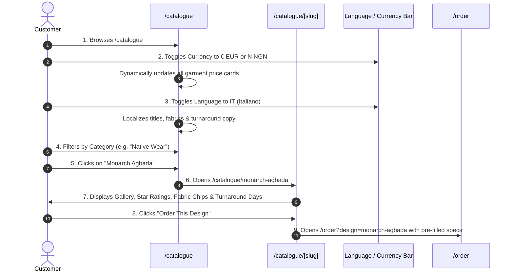

# Flow 05: Customer Catalogue Discovery & Localization Flow

## 1. Flow Overview & Objective
This flow covers how prospective patrons explore CaptainStitches' bespoke lookbook, filter by tailoring categories, inspect fabrics and color swatches, switch currencies (**€ EUR** vs **₦ NGN**) and languages (**English** vs **Italiano**), and transition into bespoke order placement or WhatsApp consultation.

---

## 2. Actors & Preconditions
- **Actor:** Prospective or Returning Customer (Unauthenticated).
- **Entry Points:**
  - Main Navigation: **"Collection"** (`/catalogue`).
  - Homepage Category Banners: `/catalogue?category=NATIVE_WEAR`.
  - Direct Lookbook Link: `/catalogue/[slug]` (e.g. `/catalogue/monarch-agbada`).

---

## 3. Detailed Step-by-Step Happy Path

### Step 1: Catalogue Grid & Category Filtering
- Patron navigates to `/catalogue`.
- Filter bar provides quick pills:
  - `All Collections`, `Native Wear (Agbada, Kaftans, Senators)`, `Suits & Blazers`, `Casual Wear`, `Accessories (Caps, Aso-Oke)`, `Children's Wear`.
- Sort selector:
  - `Featured First`, `Price: Low to High`, `Price: High to Low`, `Fastest Turnaround`.

### Step 2: Currency & Language Localization
- **Currency Switcher:**
  - When switched to **EUR (€)**: Garment cards render European market pricing (e.g. `€150.00`).
  - When switched to **NGN (₦)**: Garment cards render Nigerian market pricing (e.g. `₦220,000`).
- **Language Switcher:**
  - **EN (English):** *"Monarch Agbada — Bespoke 3-piece hand-loomed attire with geometric royal embroidery"*.
  - **IT (Italiano):** *"Agbada Monarch — Abito tradizionale nigeriano su misura a 3 pezzi in cashmere presidenziale"*.

### Step 3: Design Detail Page (`/catalogue/[slug]`)
- **Visual Showcase:** High-resolution multi-angle photography gallery with primary preview and thumbnail strip.
- **Craftsmanship Metadata:**
  - Turnaround time badge: `⏱ 10–14 Days Handcrafting`.
  - Verified Patron Ratings: `★ 4.9 (14 Reviews)`.
  - Fabric swatches available: *Presidential Cashmere*, *Super 150s Wool*, *Italian Linen*.
  - Colourways: *Midnight Black*, *Emerald Green*, *Royal Blue*, *Wine/Burgundy*.
- **Action Triggers:**
  - **Primary CTA:** *"Order This Design"* (routes to `/order?design=monarch-agbada`).
  - **Secondary CTA:** *"Consult on WhatsApp"* (opens direct chat with Samuelson pre-populated with garment name).

---

## 4. Edge Cases & Handling

| Edge Case | Scenario / Trigger | System Response & UI Behavior |
| :--- | :--- | :--- |
| **Hidden / Archived Design** | User visits direct link to an unlisted design `/catalogue/old-season-suit` where `isVisible: false`. | Server returns 404 page with courteous notice: *"This piece is currently unavailable in the public lookbook"* and a button back to the active collection. |
| **Category with 0 Active Designs** | User filters by a seasonal category with no active items. | Renders tailored empty state: *"No bespoke designs currently in this category. Inquire on WhatsApp for custom requests."* |
| **Design with Zero Reviews** | Newly uploaded design with no approved reviews yet. | Displays clean badge: *"New Bespoke Commission — Be the first patron to review"* instead of blank stars. |
| **Currency Display Desync** | User switches currency on catalogue and proceeds to order page. | Selected currency preference persists across session via state / URL params. |

---

## 5. Database Queries

- `prisma.design.findMany({ where: { isVisible: true }, include: { photos: true, reviews: { where: { status: 'APPROVED' } } } })`
- Star rating calculation: `avgRating = reviews.reduce((acc, r) => acc + r.rating, 0) / reviews.length`.

---

## 6. QA / Manual Testing Checklist

- [x] **TC-05.1:** Open `/catalogue` -> test filtering by each category pill.
- [x] **TC-05.2:** Toggle currency `EUR` ↔ `NGN` -> verify prices switch instantly.
- [x] **TC-05.3:** Toggle language `EN` ↔ `IT` -> verify Italian translations render.
- [x] **TC-05.4:** Open `/catalogue/monarch-agbada` -> verify image carousel, turnaround days, and review count.
- [x] **TC-05.5:** Click *"Order This Design"* -> verify `/order` loads with Monarch Agbada pre-selected.
- [x] **TC-05.6:** Click *"Consult on WhatsApp"* -> verify WhatsApp opens with correct garment title in query.
