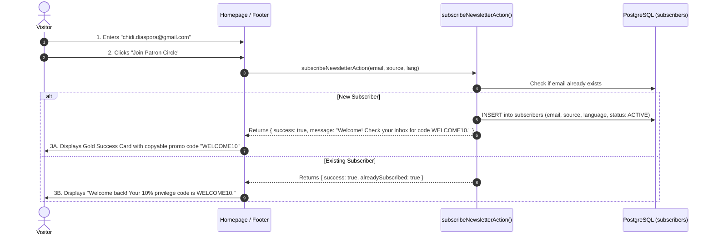

# Flow 06: Customer Lead Capture & Newsletter Flow

## 1. Flow Overview & Objective
This flow enables prospective clients to join the **CaptainStitches Patron Circle** by submitting their email address on the homepage, footer, or during checkout in exchange for a **10% welcome commission incentive**. Leads are saved to the PostgreSQL `subscribers` table and synced with the email marketing engine (Mailchimp / Brevo).

---

## 2. Actors & Preconditions
- **Actor:** Prospective Customer / Website Visitor (Unauthenticated).
- **Entry Points:**
  - Homepage Email Capture Section: `"Join the Patron Circle & Enjoy 10% Off"`.
  - Global Sitewide Footer Newsletter Input.
  - Checkout Step 3 Opt-in Checkbox.

---

## 3. Detailed Step-by-Step Happy Path

### Step 1: Input & Incentive Offer
- Visitor views the high-contrast obsidian & gold email capture module:
  - Headline: *"Bespoke Craftsmanship in Your Inbox — Join the Patron Circle"*.
  - Subtitle: *"Receive early access to seasonal fabric drops, trunk shows in Italy, and 10% off your initial order."*
- User enters their email address: e.g. `emeka.verona@gmail.com`.

### Step 2: Submission & Server Action Execution
- Frontend calls `subscribeNewsletterAction`:
  - Validates RFC-compliant email formatting.
  - Detects active language preference (`EN` or `IT`).
  - Identifies capture source (`homepage`, `footer`, or `checkout`).
- Database records the subscriber:
  - `email`: `emeka.verona@gmail.com`
  - `status`: `ACTIVE`
  - `language`: `EN`
  - `source`: `homepage`

### Step 3: Success Experience & Direct Value
- Form transitions into an animated confirmation state:
  - Displays: *"✦ Welcome to the Circle! Use code **WELCOME10** at checkout for 10% off."*
  - Provides a one-click button: *"Explore the Collection Now →"* linking directly to `/catalogue`.

---

## 4. Edge Cases & Handling

| Edge Case | Scenario / Trigger | System Response & UI Behavior |
| :--- | :--- | :--- |
| **Invalid Email Syntax** | User types `emeka@` or `test.com` without `@`. | Inline validation flags input immediately: *"Please enter a valid email address."* |
| **Duplicate / Existing Subscriber** | User re-enters an email already in the `subscribers` table. | System gracefully acknowledges without error: *"You are already subscribed! Your welcome code is WELCOME10."* |
| **Italian Language Context** | Visitor submits email on the Italian version of the site (`IT`). | Record stores `language: IT`; automated welcome campaign triggers in Italian. |
| **Network Timeout / Rate Limit** | Repeated rapid submissions from same IP. | Rate limiter limits to 3 submissions per minute per IP to prevent spam. |

---

## 5. Database Schema

- **Model:** `Subscriber`
  - `id`: CUID
  - `email`: String (Unique)
  - `name`: String (Optional)
  - `source`: String (`"homepage"`, `"footer"`, `"checkout"`)
  - `language`: `EN | IT`
  - `status`: `ACTIVE | UNSUBSCRIBED | BOUNCED`
  - `openCount`: Int (Default: 0)
  - `createdAt`: DateTime

---

## 6. QA / Manual Testing Checklist

- [x] **TC-06.1:** Enter invalid email `test@` on homepage -> verify inline validation error.
- [x] **TC-06.2:** Enter valid new email `test.lead@stitches.com` -> submit -> verify success banner with `WELCOME10`.
- [x] **TC-06.3:** Re-submit the same email `test.lead@stitches.com` -> verify graceful "Already subscribed" notice.
- [x] **TC-06.4:** Open `/admin/marketing/subscribers` -> verify `test.lead@stitches.com` appears in the active subscriber list.
