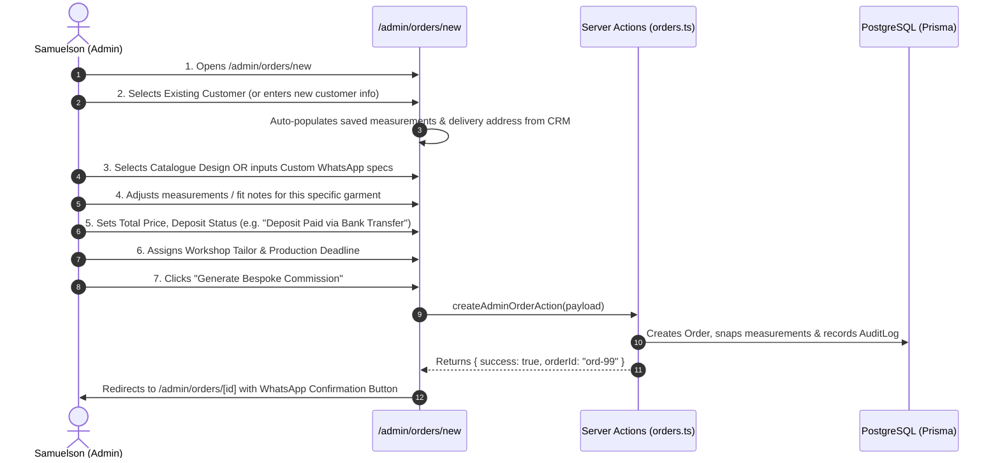

# Flow 07: Admin Manual Order Creation Flow

## 1. Flow Overview & Objective
This flow allows Master Tailor Samuelson or an Atelier Admin to create bespoke orders directly from the back-office for clients who consult via WhatsApp, phone call, direct bank transfer, or in-person fittings at the Verona Atelier or Nigerian workshops.

---

## 2. Actors & Preconditions
- **Actor:** Master Tailor Samuelson / Atelier Admin (Authenticated).
- **Entry Points:**
  - Orders Index: [`/admin/orders`](file:///Users/danielnwokocha/Documents/projects/captain-stitches/src/app/admin/orders/page.tsx) -> Click **"+ Create New Order"**.
  - Direct URL: [`/admin/orders/new`](file:///Users/danielnwokocha/Documents/projects/captain-stitches/src/app/admin/orders/new/page.tsx).
  - Customer CRM: [`/admin/customers/[id]`](file:///Users/danielnwokocha/Documents/projects/captain-stitches/src/app/admin/customers/%5Bid%5D/page.tsx) -> Click **"Create Order for Customer"**.

---

## 3. Detailed Step-by-Step Happy Path

### Step 1: Customer Selection or Instant Registration
- **Mode A: Existing Customer Lookup**
  - Type-ahead search by Name, Phone, or Email (e.g. *Daniel Nwokocha*).
  - System pulls address, location (🇮🇹 Italy / 🇳🇬 Nigeria), and historical measurements into the form.
- **Mode B: Quick Create Customer**
  - Inputs: First Name, Last Name, WhatsApp Phone, Email, Delivery Location, Shipping Address.

### Step 2: Garment Design & Custom Specifications
- **Catalogue Selection:** Pick from published catalogue (e.g. *Monarch Agbada*, *Presidential Kaftan*).
- **Custom Bespoke Commission:** Enter custom title (e.g. *"5-Piece Royal Gold Wedding Agbada with Custom Monogram"*), upload client reference photo.
- Fabric & Colour specs: e.g. *Midnight Navy Presidential Wool*, *Gold Thread Embroidery*.

### Step 3: Measurement Snapshot & Sizing Customization
- Automatically pre-filled from customer's profile if on file:
  - Jacket / Top: `Neck`, `Shoulder`, `Chest`, `Sleeve`, `Top Length`, `Bicep`, `Wrist`.
  - Trouser: `Waist`, `Hips`, `Inseam`, `Outseam`, `Thigh`.
- Admin can adjust numbers for this specific outfit (e.g. *"Client requested extra 2cm allowance on sleeves for cufflinks"*).
- Snapshot is saved immutably to the order to prevent changes to historical fit records.

### Step 4: Financial Configuration & Payment Tracking
- **Currency:** `EUR (€)` or `NGN (₦)`.
- **Total Commission Amount:** e.g. `€240.00` / `₦350,000`.
- **Deposit Paid Amount:** e.g. `€120.00`.
- **Payment Method & Reference:** `Bank Transfer (Revolut / GTBank)`, `Cash in Atelier`, `Stripe POS`.
- **Deposit Status Toggle:** `PENDING` vs `DEPOSIT_PAID` vs `FULLY_PAID`.

### Step 5: Workshop Assignment & Delivery Target
- Assign tailor: `Master Tailor Samuelson`, `Abuja Workshop Tailor`, `Aba Master Artisan`.
- Production Deadline & Estimated Delivery Date.
- Occasion: e.g. *Groom Wedding in Milan*.

### Confirmation & One-Tap WhatsApp Dispatch
- System creates order with status `CONFIRMED` (if deposit marked paid) or `NEW`.
- Redirects to `/admin/orders/[id]`.
- Top bar displays **"Send Confirmation to Customer via WhatsApp"** -> clicking opens WhatsApp Web/App with formatted order receipt and tracking link.

---

## 4. Edge Cases & Handling

| Edge Case | Scenario / Trigger | System Response & UI Behavior |
| :--- | :--- | :--- |
| **Deposit Exceeds Total Amount** | Admin accidentally inputs `Deposit: €300` on a `€200` order. | Validation prevents save with message: *"Deposit amount cannot exceed total commission price."* |
| **Past Deadline Date** | Selected deadline date is yesterday or in the past. | Datepicker blocks past dates; warning asks for valid future target. |
| **Duplicate Order Creation** | Admin double-clicks submit button. | Button disables with spinner on first click; backend idempotency prevents duplicate order numbers. |
| **Customer Has No Phone Number** | Admin enters only an email for a client. | Allowed, but displays reminder: *"WhatsApp updates require a valid phone number with country code."* |

---

## 5. Database Records Created

1. **`orders` Table:**
   - `orderNumber`: Auto-generated unique string `CS-2026-XXXX`.
   - `customerId`, `designId` (optional), `tailorId` (optional).
   - `totalAmount`, `depositPaid: boolean`, `balancePaid: boolean`, `status: CONFIRMED | NEW`.
   - `measurementSnapshot: JSON`.
2. **`audit_logs` Table:**
   - Action: `ORDER_CREATED_MANUAL`, `userId: admin.id`, `details: { orderNumber, totalAmount }`.

---

## 6. QA / Manual Testing Checklist

- [x] **TC-07.1:** Open `/admin/orders/new` -> select existing customer "Daniel Nwokocha" -> verify measurements auto-fill.
- [x] **TC-07.2:** Switch customer to new client "Ifeanyi Alabi" -> fill contact details -> verify customer created in DB.
- [x] **TC-07.3:** Select "Custom Design" -> enter custom title & tailoring notes -> submit.
- [x] **TC-07.4:** Mark deposit as paid via "Bank Transfer" -> verify order created in `CONFIRMED` status.
- [x] **TC-07.5:** Check `/admin/orders` Kanban board -> verify new order card appears under `CONFIRMED` column.
- [x] **TC-07.6:** Click *"Send WhatsApp Update"* on order page -> verify pre-filled message syntax.
