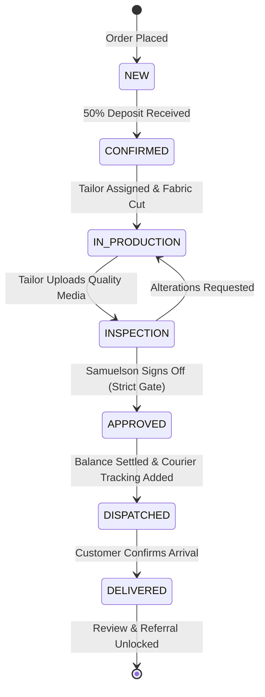

# Flow 08: Admin Order Production & Inspection Lifecycle Flow

## 1. Flow Overview & Objective
This flow governs the rigid 7-stage production state machine for bespoke garments. It covers the drag-and-drop Kanban board management, tailor workshop assignment, photo/video inspection submission, Master Tailor Samuelson's mandatory quality sign-off gate, balance settlement, and courier dispatch to Italy or Nigeria.

---

## 2. The 7-Stage State Machine

| Stage Code | Display Title | Responsible Actor | Action Trigger / Gate Condition |
| :--- | :--- | :--- | :--- |
| **`NEW`** | Received | System / Client | Order placed; awaiting 50% deposit. |
| **`CONFIRMED`** | Deposit Paid | Gateway / Admin | 50% deposit paid; queued for cutting. |
| **`IN_PRODUCTION`** | In Production | Assigned Tailor | Fabric cut; stitching & embroidery active. |
| **`INSPECTION`** | Final Inspection | Workshop Tailor | Tailoring finished; inspection photos uploaded. |
| **`APPROVED`** | Quality Signed-Off | Master Tailor Samuelson | **MANDATORY GATE:** Samuelson signs off on seams & fit. |
| **`DISPATCHED`** | In Transit | Admin / Courier | Balance paid; DHL/Courier tracking code logged. |
| **`DELIVERED`** | Delivered | Customer / Admin | Customer confirmed delivery; review unlocked. |

---

## 3. Detailed Step-by-Step Happy Path



### Step 1: Kanban Board Overview & Filtering
- Admin visits `/admin/orders`.
- Board displays 7 columns with live badge counts and total monetary value.
- Filter by: *Location (🇮🇹 Italy / 🇳🇬 Nigeria)*, *Assigned Tailor*, *Urgency (Overdue, Due This Week)*, or search by customer name/order ID.
- Overdue orders display an amber/red pulsing badge: `⚠ Deadline Passed`.

### Step 2: Transitioning to Production
- Admin drags card from **`CONFIRMED`** to **`IN_PRODUCTION`** (or updates status dropdown in `/admin/orders/[id]`).
- Modal prompts: *Assign Tailor* (e.g. *Aba Master Tailor Sunday*) and confirms cutting start date.
- Database records status change and logs audit event.

### Step 3: Workshop Inspection Submission (`INSPECTION`)
- Workshop tailor finishes handcrafting.
- In order details (`/admin/orders/[id]`), tailor uploads high-definition inspection media:
  - *Front full attire view*, *Collar & neckline embroidery*, *Inner seam stitching*, *Trouser hemline*.
- Status updates to **`INSPECTION`**.
- Automated alert notifies Samuelson: *"Order CS-0092 is ready for master quality inspection."*

### Step 4: Master Quality Sign-Off Gate (`APPROVED`)
- **Strict Rule:** No garment may be dispatched without Master Tailor Samuelson's explicit sign-off.
- Samuelson opens `/admin/orders/[id]`:
  - Reviews high-resolution photos and seam alignment against the client's measurement snapshot.
  - Clicks **"✦ Approve Quality & Sign Off"**.
  - Enters optional inspection note: *"Embroidery perfectly aligned, 42cm neck verified."*
- System transitions order to **`APPROVED`** and records `approvedById: samuelson_user_id` and `inspectionApprovedAt: now()`.

### Step 5: Balance Settlement & Courier Dispatch (`DISPATCHED`)
- Once approved, admin checks balance status:
  - If balance is due: Clicks *"Generate Balance Payment Link"* and shares with client on WhatsApp.
  - Client pays remaining 50% balance (or admin marks *"Balance Paid via Bank Transfer"*).
- Admin inputs shipping details:
  - Courier: *DHL Express (Italy)* / *Fez Delivery (Nigeria)*.
  - Tracking Number: `DHL-IT-982341823`.
- Admin clicks **"Mark as Dispatched"**. Order status moves to **`DISPATCHED`**.
- Public tracking page (`/track?order=CS-0092`) immediately updates to show the in-transit state and tracking number.

### Step 6: Delivery Confirmation (`DELIVERED`)
- Courier confirms package delivery or client acknowledges arrival.
- Admin updates status to **`DELIVERED`**.
- Side effects triggered:
  - Order tracking page enables the **"Leave a Review on this Attire"** button.
  - If the client was referred, the referrer's milestone progress updates in the background.

---

## 4. Edge Cases & Handling

| Edge Case | Scenario / Trigger | System Response & UI Behavior |
| :--- | :--- | :--- |
| **Bypassing Quality Inspection** | Admin attempts to drag an order directly from `IN_PRODUCTION` to `DISPATCHED`. | System validation blocks transition: *"Order cannot be dispatched without Master Tailor inspection approval."* |
| **Inspection Rejection / Alteration** | Samuelson finds a loose thread or inaccurate chest measurement. | Samuelson clicks *"Request Alteration"*, inputs notes (*"Shorten sleeves by 1.5cm"*). Order returns to `IN_PRODUCTION`. |
| **Dispatch with Unpaid Balance** | Admin clicks Dispatch while `balancePaid` is `false`. | Confirmation modal warns: *"This order has an outstanding balance of €70. Are you sure you want to dispatch before balance settlement?"* |
| **Lost or Damaged in Transit** | Courier reports delivery exception. | Admin logs notes in CRM, flags order, and initiates priority rush remake workflow. |

---

## 5. Database State Progression

```typescript
// Prisma status transition update
await prisma.order.update({
  where: { id: orderId },
  data: {
    status: OrderStatus.APPROVED,
    inspectionApprovedById: adminUserId,
    inspectionApprovedAt: new Date(),
    auditLogs: {
      create: {
        action: 'ORDER_STAGE_CHANGED',
        details: { from: 'INSPECTION', to: 'APPROVED' },
      },
    },
  },
})
```

---

## 6. QA / Manual Testing Checklist

- [x] **TC-08.1:** Drag card from `NEW` to `CONFIRMED` on Kanban board -> verify status updates.
- [x] **TC-08.2:** Drag card from `CONFIRMED` to `IN_PRODUCTION` -> verify tailor assignment modal appears.
- [x] **TC-08.3:** Upload 3 inspection photos on `/admin/orders/[id]` -> verify photos render in gallery.
- [x] **TC-08.4:** As Samuelson, click *"Approve Quality"* -> verify order status transitions to `APPROVED`.
- [x] **TC-08.5:** Enter DHL tracking code -> click *"Dispatch"* -> verify status changes to `DISPATCHED`.
- [x] **TC-08.6:** Open public `/track?order=[id]` in another tab -> verify live stepper reflects `In Transit` with tracking code.
- [x] **TC-08.7:** Mark order `DELIVERED` -> verify `/track` now shows review submission button.
