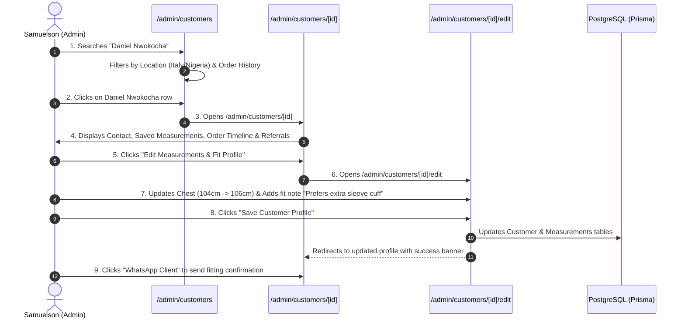

# Flow 09: Admin Customer CRM & Measurements Flow

## 1. Flow Overview & Objective
This flow enables atelier administrators to manage the customer database, view detailed patron profiles across Italy and Nigeria, maintain accurate 10-point jacket and trouser measurements, document fit preferences, inspect lifetime commission history, and initiate one-click WhatsApp consultations.

---

## 2. Actors & Preconditions
- **Actor:** Master Tailor Samuelson / Atelier Admin (Authenticated).
- **Entry Points:**
  - Customer Directory: [`/admin/customers`](file:///Users/danielnwokocha/Documents/projects/captain-stitches/src/app/admin/customers/page.tsx).
  - Customer Profile: [`/admin/customers/[id]`](file:///Users/danielnwokocha/Documents/projects/captain-stitches/src/app/admin/customers/%5Bid%5D/page.tsx).
  - Edit Profile: [`/admin/customers/[id]/edit`](file:///Users/danielnwokocha/Documents/projects/captain-stitches/src/app/admin/customers/%5Bid%5D/edit/page.tsx).
  - Add Customer: [`/admin/customers/new`](file:///Users/danielnwokocha/Documents/projects/captain-stitches/src/app/admin/customers/new/page.tsx).

---

## 3. Detailed Step-by-Step Happy Path



### Step 1: Customer Directory & Search (`/admin/customers`)
- Admin navigates to `/admin/customers`.
- Table renders:
  - *Patron Avatar & Initials*, *Full Name*, *Location Badge (🇮🇹 Italy / 🇳🇬 Nigeria)*, *Phone / WhatsApp*, *Total Orders*, *Total Spent (EUR / NGN)*, *Referral Status*.
- Search bar dynamically filters by Name, Phone, or Email with zero latency.
- Filter pills: `All`, `Italy Patrons`, `Nigeria Patrons`, `Repeat Clients (2+ Orders)`, `VIP Ambassadors`.

### Step 2: Customer Profile Deep-Dive (`/admin/customers/[id]`)
The customer page provides a comprehensive 360° overview:
1. **Patron Header:** Name, verified email, WhatsApp link, preferred language (`EN` / `IT`), preferred currency (`EUR` / `NGN`), and delivery address.
2. **Standard Measurement Card:**
   - Unit toggle: `Inches` vs `Centimetres (CM)`.
   - Upper Body: *Neck, Shoulder, Chest, Sleeve Length, Bicep, Wrist, Top Length*.
   - Lower Body: *Waist, Hips, Inseam, Outseam, Thigh*.
   - Fit Notes: *"Prefers tapered trousers with 2-inch cuff, loose armhole."*
3. **Bespoke Order History:** Card list of all past commissions with garment photo thumbnails, order numbers, delivery dates, and payment states.
4. **Referral Ambassadorship:** Active share link, total friends introduced, confirmed conversions, and rewarded vouchers.
5. **Administrative Notes:** Private notes logged by Samuelson (e.g. *"Met at Milan cultural gala, requires 1-week express turnaround for December wedding"*).

### Step 3: Updating Measurements & Fit Notes (`/admin/customers/[id]/edit`)
- Admin clicks **"Edit Profile"**.
- Form allows updating:
  - Contact information and shipping address.
  - Precise numerical measurements (supports decimals e.g. `42.5cm`).
  - Fit notes and tailoring preferences.
- Admin clicks **"Save Changes"**.
- Database updates `customers` and `measurements` records.

---

## 4. Edge Cases & Handling

| Edge Case | Scenario / Trigger | System Response & UI Behavior |
| :--- | :--- | :--- |
| **Phone Number Collision** | Admin edits customer phone to a number already registered to another user. | Validation blocks update with error: *"Phone number is already associated with customer #CUST-42."* |
| **Active Order Measurement Preservation** | Customer's profile measurements are updated while an active order is being sewn. | Profile measurements update for future orders; active order retains its immutable `measurementSnapshot` to prevent in-flight sewing discrepancies. |
| **Missing Measurements on Order Creation** | Customer is created without measurements initially. | Profile displays an amber badge: `Measurements Pending`. Reminds admin to schedule a WhatsApp measurement consultation. |
| **Deleting Patron with Order History** | Admin attempts to delete a customer who has past orders. | System restricts hard deletion to maintain financial and tax records; provides an *"Archive / Deactivate"* option instead. |

---

## 5. Database Schema & Relations

```prisma
model Customer {
  id                 String             @id @default(cuid())
  firstName          String
  lastName           String
  email              String?            @unique
  phone              String             @unique
  whatsapp           String?
  deliveryLocation   DeliveryLocation?
  deliveryAddress    String?
  adminNotes         String?
  measurements       Measurement?
  orders             Order[]
  referralsSent      Referral[]         @relation("ReferrerCustomer")
}
```

---

## 6. QA / Manual Testing Checklist

- [x] **TC-09.1:** Open `/admin/customers` -> search "Daniel" -> verify matching customer card appears.
- [x] **TC-09.2:** Open `/admin/customers/[id]` -> verify 10-point measurement numbers and order history render.
- [x] **TC-09.3:** Click *"Edit Customer"* -> change waist measurement -> click Save -> verify updated number.
- [x] **TC-09.4:** Click *"WhatsApp Client"* button -> verify WhatsApp opens with customer's international phone number.
- [x] **TC-09.5:** Click `+ Add Customer` -> fill new client form -> verify new profile appears in directory.
