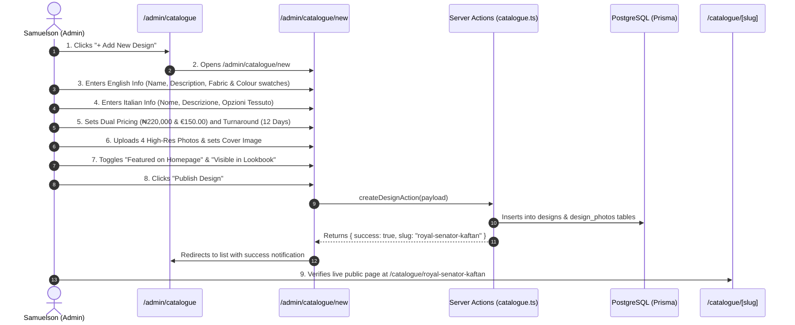

# Flow 10: Admin Catalogue & Design CMS Flow

## 1. Flow Overview & Objective
This flow allows Master Tailor Samuelson to manage the bespoke lookbook: authoring new garment designs, entering bilingual content (**English** & **Italian**), setting independent dual-currency prices (**₦ NGN** and **€ EUR**), managing photo galleries, toggling homepage featured items, and archiving seasonal pieces without deleting historical order associations.

---

## 2. Actors & Preconditions
- **Actor:** Master Tailor Samuelson / Atelier Admin (Authenticated).
- **Entry Points:**
  - Catalogue List: [`/admin/catalogue`](file:///Users/danielnwokocha/Documents/projects/captain-stitches/src/app/admin/catalogue/page.tsx).
  - Add New Design: [`/admin/catalogue/new`](file:///Users/danielnwokocha/Documents/projects/captain-stitches/src/app/admin/catalogue/new/page.tsx).
  - Design Overview: [`/admin/catalogue/[id]`](file:///Users/danielnwokocha/Documents/projects/captain-stitches/src/app/admin/catalogue/%5Bid%5D/page.tsx).

---

## 3. Detailed Step-by-Step Happy Path



### Step 1: Design Identity & Categorization
- Input unique design title: e.g. *"Royal Senator Kaftan with Gold Embroidery"*.
- URL slug auto-generates: `royal-senator-kaftan` (editable).
- Category selection: `Native Wear`, `Suits & Blazers`, `Casual Wear`, `Accessories`, `Children's Wear`.
- Turnaround time: `12 Days`.

### Step 2: Dual-Language Authoring (EN / IT)
- **English Tab:**
  - Title: *Royal Senator Kaftan*
  - Description: *Tailored from structured presidential cashmere with hand-sewn gold geometric collar.*
  - Fabric Options: `Presidential Cashmere`, `Super 150s Wool`.
  - Colourways: `Midnight Navy`, `Imperial Black`, `Burgundy`.
- **Italian Tab:**
  - Title: *Kaftan Senatore Reale*
  - Description: *Realizzato su misura in cashmere presidenziale strutturato con ricami dorati eseguiti a mano.*
  - Fabric Options: `Cashmere Presidenziale`, `Lana Super 150s`.

### Step 3: Dual-Currency Market Pricing
- **Nigeria Market Price:** `₦220,000`
- **European Market Price:** `€150.00`
- Pricing Note (Optional): *"Includes matching embroidered chest pocket handkerchief."*

### Step 4: Photo Gallery Management
- Upload high-resolution model photography (supports drag-and-drop).
- Star icon toggle sets the **Primary Lookbook Cover Photo**.
- Drag handles allow re-ordering gallery sequence.

### Step 5: Visibility & Publishing Controls
- **Featured Toggle (`isFeatured`):** Highlights design on the Homepage Showcase carousel.
- **Visibility Toggle (`isVisible`):** Immediately shows/hides the piece on public storefront.
- Clicks **"Publish Design to Lookbook"**.

---

## 4. Edge Cases & Handling

| Edge Case | Scenario / Trigger | System Response & UI Behavior |
| :--- | :--- | :--- |
| **Slug Duplicate Collision** | Admin creates a design with an existing slug (e.g. `monarch-agbada`). | System detects uniqueness conflict and appends numeric suffix: `monarch-agbada-2`. |
| **Zero or Negative Price** | Admin accidentally inputs `€0` or `-€10`. | Form validation prevents submission: *"Price must be greater than zero."* |
| **Missing Image Uploads** | Admin publishes design without attaching at least 1 photo. | Form prompts: *"Please upload at least one primary garment photo before publishing."* |
| **Deleting Design with Historical Orders** | Admin clicks delete on a piece that was ordered by 15 clients. | Safe constraint prevents hard database cascade delete; automatically switches `isVisible: false` to preserve order receipts. |

---

## 5. Database Schema & Relations

```prisma
model Design {
  id              String         @id @default(cuid())
  slug            String         @unique
  category        DesignCategory
  isFeatured      Boolean        @default(false)
  isVisible       Boolean        @default(true)
  turnaroundDays  Int
  priceNGN        Float
  priceEUR        Float
  nameEN          String
  descriptionEN   String
  nameIT          String
  descriptionIT   String
  photos          DesignPhoto[]
  orders          Order[]
  reviews         Review[]
}
```

---

## 6. QA / Manual Testing Checklist

- [x] **TC-10.1:** Open `/admin/catalogue` -> click `+ Add New Design`.
- [x] **TC-10.2:** Fill English and Italian text fields -> set pricing `₦200,000` / `€140.00`.
- [x] **TC-10.3:** Attach 2 photos -> set primary photo -> toggle `Featured`.
- [x] **TC-10.4:** Click Publish -> verify design appears in `/admin/catalogue` list.
- [x] **TC-10.5:** Open public `/catalogue` -> verify new design card renders with correct price and photo.
- [x] **TC-10.6:** Toggle visibility off in admin -> verify design disappears from public catalogue but remains visible in admin.
