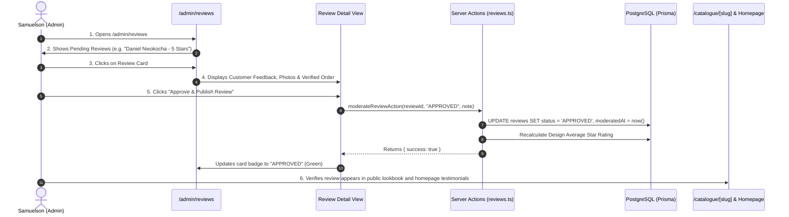

# Flow 11: Admin Review Moderation Flow

## 1. Flow Overview & Objective
This flow details how Master Tailor Samuelson and atelier admins manage the review moderation queue. Submitted client reviews undergo quality and authenticity verification before approval, dynamically updating public star ratings and the homepage testimonial feed.

---

## 2. Actors & Preconditions
- **Actor:** Master Tailor Samuelson / Atelier Admin (Authenticated).
- **Entry Points:**
  - Reviews Queue: [`/admin/reviews`](file:///Users/danielnwokocha/Documents/projects/captain-stitches/src/app/admin/reviews/page.tsx).
  - Review Detail: [`/admin/reviews/[id]`](file:///Users/danielnwokocha/Documents/projects/captain-stitches/src/app/admin/reviews/%5Bid%5D/page.tsx).

---

## 3. Detailed Step-by-Step Happy Path



### Step 1: Moderation Queue Inspection (`/admin/reviews`)
- Status tabs:
  - `Pending Approval (3)` (Amber badge)
  - `Approved Reviews (18)` (Green badge)
  - `Rejected / Flagged (1)` (Red badge)
- Table/Grid displays: *Patron Name*, *Star Rating (★ 5/5)*, *Design Commissioned*, *Verified Order ID*, *Review Date*, *Quick Action Buttons*.

### Step 2: Verification of Client Feedback
- Admin inspects the submission:
  - Order verification: Confirms order `CS-0092` was genuinely delivered.
  - Review content: Inspects feedback on fit, fabric texture, and craft quality.
  - Photo attachments: Inspects client photos to verify authentic garment wear.

### Step 3: Moderation Action Execution
- **Action A: Approve (`APPROVED`)**
  - Admin clicks **"✓ Approve Review"**.
  - System marks review as verified.
  - Triggers automatic cache revalidation for `/catalogue`, `/catalogue/[slug]`, and `/`.
- **Action B: Reject (`REJECTED`)**
  - Admin clicks **"✕ Reject"**, inputs moderator reason (e.g. *"Spam or offensive content"*).
  - Review is permanently hidden from public storefront.

---

## 4. Edge Cases & Handling

| Edge Case | Scenario / Trigger | System Response & UI Behavior |
| :--- | :--- | :--- |
| **Review on Archived Design** | A review is submitted for a seasonal design that was recently hidden from catalogue. | Review can still be approved; rating recalculates in database without breaking frontend lookbook grids. |
| **Edited Review Re-moderation** | A patron edits an already approved review on `/review`. | System automatically resets the review status to `PENDING` to ensure modified text is verified before displaying publicly. |
| **Unlinked Order ID** | Review submission with an unverified order reference. | Warning flag: `⚠ Unverified Order`. Admin can manually link the customer's actual order ID before approving. |

---

## 5. Database Schema & State Transitions

```prisma
model Review {
  id             String       @id @default(cuid())
  customerId     String
  orderId        String
  designId       String?
  rating         Int          // 1 to 5
  comment        String
  photoUrls      String[]
  status         ReviewStatus @default(PENDING)
  moderatedAt    DateTime?
  moderatedById  String?
  moderatorNote  String?
}
```

---

## 6. QA / Manual Testing Checklist

- [x] **TC-11.1:** Open `/admin/reviews` -> verify pending reviews tab shows count.
- [x] **TC-11.2:** Click on pending review from Daniel Nwokocha -> verify comment and rating render.
- [x] **TC-11.3:** Click *"Approve Review"* -> verify status badge turns green `APPROVED`.
- [x] **TC-11.4:** Open `/catalogue/teal-green-agbada` in incognito -> verify review and star rating appear.
- [x] **TC-11.5:** Open homepage `/` -> verify approved 5-star review appears in the Testimonial Carousel.
- [x] **TC-11.6:** Reject a spam test review -> verify review is omitted from public pages.
