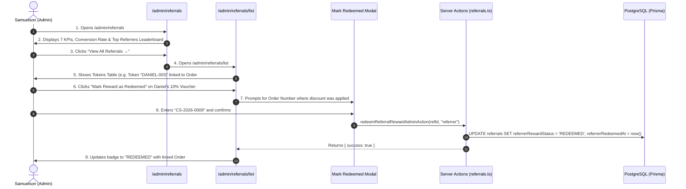

# Flow 12: Admin Referral Management & Rewards Flow

## 1. Flow Overview & Objective
This flow details how administrators supervise the customer referral system: tracking the 7-KPI performance strip, managing the top referrers leaderboard, monitoring individual token conversions, redeeming kickback vouchers against new order numbers, manually granting ambassador perks, and toggling programme rules.

---

## 2. Actors & Preconditions
- **Actor:** Master Tailor Samuelson / Atelier Admin (Authenticated).
- **Entry Points:**
  - Referral Dashboard: [`/admin/referrals`](file:///Users/danielnwokocha/Documents/projects/captain-stitches/src/app/admin/referrals/page.tsx).
  - Referral Tokens List: [`/admin/referrals/list`](file:///Users/danielnwokocha/Documents/projects/captain-stitches/src/app/admin/referrals/list/page.tsx).
  - Rewards Configuration: [`/admin/referrals/rewards`](file:///Users/danielnwokocha/Documents/projects/captain-stitches/src/app/admin/referrals/rewards).
  - Programme Rules: [`/admin/referrals/settings`](file:///Users/danielnwokocha/Documents/projects/captain-stitches/src/app/admin/referrals/settings).

---

## 3. Detailed Step-by-Step Happy Path



### Step 1: 7-KPI Performance Dashboard (`/admin/referrals`)
1. **Links Generated:** Total active referral tokens spawned.
2. **Link Visits:** Unique visits logged across `/ref/[token]`.
3. **Converted Orders:** Paid bespoke commissions attributed to referrals.
4. **Conversion Rate (%):** Calculated as $(\text{Converted} / \text{Generated}) \times 100\%$.
5. **Rewards Issued:** Total kickback vouchers credited.
6. **Rewards Redeemed:** Vouchers applied to subsequent commissions.
7. **Pending Redemption:** Active unclaimed patron credits.

### Step 2: Top Referrers Leaderboard
- Displays ranked ambassadors with medals:
  - 🥇 **Daniel Nwokocha** (Nigeria / Italy) — *3 Sent, 2 Converted (67% Rate)*.
  - 🥈 **Chidi Okonkwo** (Italy) — *4 Sent, 2 Converted (50% Rate)*.
- Clicking any row navigates directly to the patron's CRM profile.

### Step 3: Token Tracking & Reward Redemption (`/admin/referrals/list`)
- Table columns:
  - *Token Code (e.g. `DANIEL-00S`)*, *Referrer Patron*, *Referred Friend*, *Conversion Status (`paid`)*, *Linked Order (`CS-0003`)*, *Referrer Reward Status*, *Referred Reward Status*, *Action Button*.
- **Mark as Redeemed Workflow:**
  1. Admin clicks **"Mark Redeemed"** next to a credited voucher.
  2. Modal opens: *Specify the order number where this 10% discount was redeemed*.
  3. Admin enters `CS-2026-0009`.
  4. System calls `redeemReferralRewardAdminAction`, updates database record, and links redemption to the new order.

### Step 4: Programme Status Control
- Header toggle: **"⏸ Pause Programme"** ↔ **"▶ Activate Programme"**.
- Pausing halts new reward credits while preserving existing tokens.

---

## 4. Edge Cases & Handling

| Edge Case | Scenario / Trigger | System Response & UI Behavior |
| :--- | :--- | :--- |
| **Redemption Without Order Number** | Admin attempts to confirm redemption leaving order input blank. | Validation alerts: *"Please specify the order number where this reward was applied."* |
| **Manual Reward for Top Ambassador** | Admin wants to gift a free embroidered cap to an ambassador with 5 referrals. | Admin clicks *"Issue Reward Manually"* modal -> selects reward type (`Priority Slot` / `Custom Cap`) -> logs reason -> reward attaches to patron profile. |
| **Token Copy Action** | Admin clicks copy icon next to token `DANIEL-00S`. | Copies full URL `https://captainstitches.com/ref/DANIEL-00S` with toast feedback: *"Copied token to clipboard!"* |

---

## 5. Database State Management

```prisma
model Referral {
  id                   String               @id @default(cuid())
  referrerId           String
  referredCustomerId   String?              @unique
  token                String               @unique
  convertedOrderId     String?
  referrerRewardType   ReferralRewardType?
  referrerRewardStatus ReferralRewardStatus @default(PENDING)
  referrerRewardValue  Float?
  referrerRedeemedAt   DateTime?
  referredRewardStatus ReferralRewardStatus @default(PENDING)
  referredRedeemedAt   DateTime?
}
```

---

## 6. QA / Manual Testing Checklist

- [x] **TC-12.1:** Open `/admin/referrals` -> verify 7 KPI summary cards display live statistics.
- [x] **TC-12.2:** Verify Top Referrers leaderboard shows Daniel Nwokocha with confirmed conversions.
- [x] **TC-12.3:** Open `/admin/referrals/list` -> search "DANIEL-00S" -> verify row renders with linked order `CS-0003`.
- [x] **TC-12.4:** Click *"Mark Redeemed"* -> enter order `CS-2026-0009` -> confirm -> verify badge turns purple `REDEEMED`.
- [x] **TC-12.5:** Click *"Pause Programme"* -> verify status changes to `Programme Paused` -> click *"Activate"* to re-enable.
