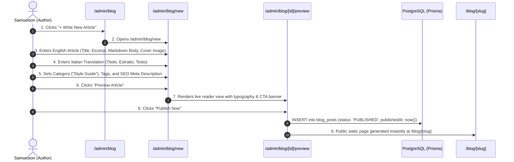

# Flow 13: Admin Blog & Editorial Content Publishing Flow

## 1. Flow Overview & Objective
This flow allows Samuelson and marketing editors to draft, preview, schedule, and publish bilingual SEO articles (**English** & **Italian**) covering bespoke styling guides, cultural attire history (Agbada, Kaftans, Senator wear), and diaspora wedding case studies, each equipped with conversion CTAs to the catalogue and order builder.

---

## 2. Actors & Preconditions
- **Actor:** Master Tailor Samuelson / Blog Author (Authenticated).
- **Entry Points:**
  - Blog Manager: [`/admin/blog`](file:///Users/danielnwokocha/Documents/projects/captain-stitches/src/app/admin/blog/page.tsx).
  - New Article Editor: [`/admin/blog/new`](file:///Users/danielnwokocha/Documents/projects/captain-stitches/src/app/admin/blog/new/page.tsx).
  - Article Analytics & Edit: [`/admin/blog/[id]`](file:///Users/danielnwokocha/Documents/projects/captain-stitches/src/app/admin/blog/%5Bid%5D/page.tsx).
  - Public Blog: [`/blog`](file:///Users/danielnwokocha/Documents/projects/captain-stitches/src/app/blog/page.tsx) and [`/blog/[slug]`](file:///Users/danielnwokocha/Documents/projects/captain-stitches/src/app/blog/%5Bslug%5D/page.tsx).

---

## 3. Detailed Step-by-Step Happy Path



### Step 1: Article Identity & Editorial Categorization
- Title (EN): *"The Modern Agbada in Europe: A Gentleman's Guide to Diaspora Weddings"*
- Title (IT): *"L'Agbada Moderno in Europa: Guida di Stile per Matrimoni ed Eventi"*
- Slug auto-generated: `the-modern-agbada-in-europe`
- Category: `Style Guides`, `Heritage & Craft`, `Client Case Studies`, `Atelier News`.
- Reading Time estimate: `5 min read`.

### Step 2: Rich Markdown Content & Imagery
- Cover Hero Image upload (16:9 ratio, optimized WebP).
- Markdown formatting support:
  - Heading 2/3 hierarchies, blockquotes from Samuelson, bulleted measurement tips.
  - Image galleries showcasing seam finishes.
  - Bottom Call to Action module: *"Ready to craft your bespoke wedding piece? Explore our collection or book a commission."*

### Step 3: Bilingual Localisation & SEO Metadata
- Meta Title: *Bespoke Agbada Tailor in Italy | CaptainStitches*
- Meta Description: *Discover how to style traditional Nigerian Agbada in Italy and Europe with bespoke cashmere tailoring by CaptainStitches.*
- Canonical URL & OpenGraph tags generated automatically.

### Step 4: Preview & Publish
- Click **"Preview Article"** -> renders simulated reader layout.
- Status toggle: `DRAFT` ↔ `SCHEDULED` ↔ `PUBLISHED`.
- Click **"Publish Now"**.

---

## 4. Edge Cases & Handling

| Edge Case | Scenario / Trigger | System Response & UI Behavior |
| :--- | :--- | :--- |
| **Duplicate Blog Slug** | Author uses the same title as an existing post. | System appends year or counter (e.g. `the-modern-agbada-in-europe-2026`). |
| **Draft Left Unfinished** | Author navigates away without saving. | Local state autosaves to browser storage to prevent accidental data loss. |
| **Unpublished Post Access** | Public user visits URL `/blog/draft-post` where `status: DRAFT`. | Server returns 404 to public visitors while allowing preview access to authenticated admins. |

---

## 5. Database Schema

```prisma
model BlogPost {
  id             String        @id @default(cuid())
  slug           String        @unique
  category       BlogCategory
  authorId       String
  titleEN        String
  contentEN      String
  excerptEN      String
  titleIT        String
  contentIT      String
  excerptIT      String
  featuredImage  String
  status         PostStatus    @default(DRAFT)
  publishedAt    DateTime?
  viewCount      Int           @default(0)
}
```

---

## 6. QA / Manual Testing Checklist

- [x] **TC-13.1:** Open `/admin/blog` -> click `+ Write New Article`.
- [x] **TC-13.2:** Fill English & Italian content -> upload hero image -> click Preview.
- [x] **TC-13.3:** Click *"Publish"* -> verify status changes to `PUBLISHED`.
- [x] **TC-13.4:** Open public `/blog` -> verify new article card appears at top of grid.
- [x] **TC-13.5:** Click article card -> verify `/blog/[slug]` renders full article with bottom CTA to `/order`.
