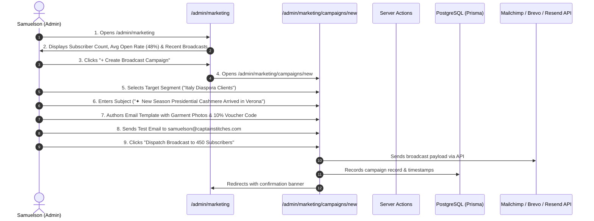

# Flow 14: Admin Marketing & Email Broadcast Campaigns Flow

## 1. Flow Overview & Objective
This flow enables atelier administrators to manage email marketing operations: organizing subscriber databases, creating customer segments (*Italy Diaspora, Nigeria Patrons, High-Value Ambassadors*), authoring broadcast newsletters with fabric drop announcements, and reviewing delivery/open rate analytics.

---

## 2. Actors & Preconditions
- **Actor:** Master Tailor Samuelson / Marketing Admin (Authenticated).
- **Entry Points:**
  - Marketing Overview: [`/admin/marketing`](file:///Users/danielnwokocha/Documents/projects/captain-stitches/src/app/admin/marketing/page.tsx).
  - Campaign Directory: [`/admin/marketing/campaigns`](file:///Users/danielnwokocha/Documents/projects/captain-stitches/src/app/admin/marketing/campaigns/page.tsx).
  - New Campaign Editor: [`/admin/marketing/campaigns/new`](file:///Users/danielnwokocha/Documents/projects/captain-stitches/src/app/admin/marketing/campaigns/new/page.tsx).
  - Subscriber Directory: [`/admin/marketing/subscribers`](file:///Users/danielnwokocha/Documents/projects/captain-stitches/src/app/admin/marketing/subscribers/page.tsx).
  - Audience Segments: [`/admin/marketing/segments`](file:///Users/danielnwokocha/Documents/projects/captain-stitches/src/app/admin/marketing/segments/page.tsx).

---

## 3. Detailed Step-by-Step Happy Path

### Step 1: Marketing Health Dashboard (`/admin/marketing`)
- KPI Strip:
  - **Total Active Subscribers:** `1,280`
  - **Average Open Rate:** `52.4%`
  - **Click-Through Rate:** `18.2%`
  - **Orders Attributed to Email:** `34 Commissions`

### Step 2: Audience Segmentation (`/admin/marketing/segments`)
- Pre-configured dynamic segments:
  - `Italy & European Diaspora`: Subscribers with Italian IP/addresses.
  - `Nigerian Patrons`: Lagos & Abuja clients.
  - `VIP Ambassador Circle`: Clients who have made 2+ orders or 3+ referrals.
  - `New Newsletter Leads`: Captured from homepage within the last 30 days without an order.

### Step 3: Campaign Authoring & Personalization (`/admin/marketing/campaigns/new`)
- Input Campaign Title: e.g. *"Autumn / Winter Bespoke Fabric Drop"*.
- Subject Line: *"Hand-woven Presidential Wool & Silk Agbada Collection"*.
- Preview Text: *"Exclusive early-access bespoke tailoring slots for December events."*
- Language targeting: `EN` or `IT`.
- Email Content Builder:
  - Hero image of new fabric roll / garment.
  - Personal greeting: `{{firstName | default: "Patron"}}`.
  - Direct CTA button: *"Book Your Workshop Slot →"*.

### Step 4: Dispatch & Performance Monitoring
- Admin tests delivery with **"Send Test Preview"**.
- Clicks **"Dispatch Campaign"** (or schedules for future date/time).
- Campaign metrics update in real-time on `/admin/marketing/campaigns/[id]`:
  - *Delivered, Opened, Clicked, Unsubscribed, Orders Generated*.

---

## 4. Edge Cases & Handling

| Edge Case | Scenario / Trigger | System Response & UI Behavior |
| :--- | :--- | :--- |
| **Unsubscribe Request** | Recipient clicks the mandatory unsubscribe link in the footer. | System automatically updates `subscribers.status` to `UNSUBSCRIBED` and suppresses future marketing emails. |
| **Bounced Email Address** | Email provider rejects delivery (mailbox full / invalid domain). | Webhook flags subscriber as `BOUNCED` and excludes from subsequent broadcasts. |
| **Sending Without Subject Line** | Admin clicks Send with blank subject. | Validation prevents dispatch: *"Subject line is required."* |

---

## 5. QA / Manual Testing Checklist

- [x] **TC-14.1:** Open `/admin/marketing` -> verify aggregate subscriber counts match database.
- [x] **TC-14.2:** Open `/admin/marketing/subscribers` -> filter by `Italy` -> verify filtered list.
- [x] **TC-14.3:** Create a new broadcast campaign -> select target segment -> author content.
- [x] **TC-14.4:** Send test preview -> verify test delivery.
- [x] **TC-14.5:** Click *"Dispatch Campaign"* -> verify campaign moves to `SENT` status with analytics.
