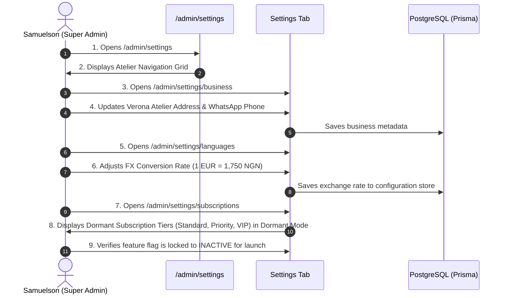

# Flow 15: Admin Settings & Atelier Configuration Flow

## 1. Flow Overview & Objective
This flow governs the master operational configuration for CaptainStitches: dual-location addresses (Verona Atelier & Nigeria Workshop), WhatsApp concierge routing, currency conversion FX rates (EUR ↔ NGN), payment gateway credentials (Stripe & Paystack), notification triggers, role-based staff permissions, and the dormant subscription tier architecture.

---

## 2. Actors & Preconditions
- **Actor:** Master Tailor Samuelson / Super Admin (Authenticated).
- **Entry Points:**
  - Settings Root: [`/admin/settings`](file:///Users/danielnwokocha/Documents/projects/captain-stitches/src/app/admin/settings/page.tsx).
  - Business Profile: [`/admin/settings/business`](file:///Users/danielnwokocha/Documents/projects/captain-stitches/src/app/admin/settings/business).
  - Payment Gateways: [`/admin/settings/payments`](file:///Users/danielnwokocha/Documents/projects/captain-stitches/src/app/admin/settings/payments).
  - Exchange Rates & Languages: [`/admin/settings/languages`](file:///Users/danielnwokocha/Documents/projects/captain-stitches/src/app/admin/settings/languages).
  - Staff Access & Roles: [`/admin/settings/access`](file:///Users/danielnwokocha/Documents/projects/captain-stitches/src/app/admin/settings/access).
  - Dormant Subscriptions: [`/admin/settings/subscriptions`](file:///Users/danielnwokocha/Documents/projects/captain-stitches/src/app/admin/settings/subscriptions).

---

## 3. Detailed Step-by-Step Happy Path



### Step 1: Business Profile & Dual-Location Configuration
- **Verona Atelier (Europe Hub):**
  - Physical Address: *Via Mazzini 14, 37121 Verona (VR), Italy*.
  - European Contact Email: *verona@captainstitches.com*.
- **Nigeria Craftsmanship Workshop:**
  - Physical Address: *Aba Artisan District / Lagos Showroom, Nigeria*.
  - Production Contact: *workshop@captainstitches.com*.
- **Primary WhatsApp Concierge Phone:**
  - Sets global number (e.g. `+234 814 071 5723` or Italian mobile) for all floating buttons and order tracking inquiries.

### Step 2: FX Rate & Currency Engine (`/admin/settings/languages`)
- Base Display Currency: `EUR (€)` vs `NGN (₦)`.
- Fixed FX Exchange Rate: e.g. `1 EUR = 1,750 NGN`.
- Auto-sync toggle (optional): Pulls live central bank rates with a configurable tailoring buffer.

### Step 3: Payment Gateways & Deposit Rules (`/admin/settings/payments`)
- **Stripe (European Payments):**
  - Publishable & Secret API Keys (Test / Live modes).
  - Supported: Visa, Mastercard, Maestro, Apple Pay, Google Pay, Bancomat.
- **Paystack (Nigerian Payments):**
  - Public & Secret Keys (Test / Live modes).
  - Supported: Naira Debit Cards, Bank Transfer, USSD.
- **Deposit Policy:** Default 50% deposit required on public orders; balance settlement required before dispatch.

### Step 4: Role-Based Access Control (RBAC) (`/admin/settings/access`)
- User Roles Supported:
  - `SUPER_ADMIN`: Full access to settings, finances, user creation, and database tools.
  - `ADMIN`: Order management, customer CRM, catalogue CMS, blog editor, reviews.
  - `MASTER_TAILOR` (Samuelson): Quality inspection sign-off, order status progression, measurement editing.
  - `TAILOR`: Assigned order viewing, inspection photo uploads.

### Step 5: Dormant Subscription Architecture (`/admin/settings/subscriptions`)
- **Architectural Provision:** Built-in capability for recurring seasonal wardrobe subscriptions without requiring a future system rebuild.
- Protected behind a feature flag: `SUBSCRIPTIONS_ENABLED = false` (Default for launch).
- Configured Tiers:
  - `Standard Bespoke Box`: 2 bespoke outfits per year + seasonal ties.
  - `Priority Sovereign Circle`: 4 bespoke attires per year + rush turnaround.
  - `VIP Ambassador Club`: Unlimited fittings + bespoke monogramming + annual gala attire.

---

## 4. Edge Cases & Handling

| Edge Case | Scenario / Trigger | System Response & UI Behavior |
| :--- | :--- | :--- |
| **Invalid FX Conversion Rate** | Admin inputs negative or zero exchange rate (e.g. `0` or `-100`). | Form blocks save: *"Exchange rate must be a positive number greater than zero."* |
| **Admin Self-Demotion / Lockout** | Only super-admin attempts to demote their own account to `TAILOR`. | System prevents action: *"Cannot demote the primary Super Administrator account."* |
| **Live Payment Key Formatting Error** | Admin inputs malformed Stripe key (e.g. missing `pk_live_` prefix). | Key format linter warns: *"Invalid Stripe API key format."* |
| **Dormant Subscription Trigger** | Public user attempts to access `/subscribe` while feature flag is off. | Server gracefully redirects to `/catalogue` or returns 404 without crashing. |

---

## 5. Database Schema

```prisma
enum UserRole {
  SUPER_ADMIN
  ADMIN
  MASTER_TAILOR
  TAILOR
}

enum SubscriptionStatus {
  INACTIVE
  ACTIVE
  CANCELLED
  PAUSED
}

enum SubscriptionTierLevel {
  STANDARD
  PRIORITY
  VIP
}
```

---

## 6. QA / Manual Testing Checklist

- [x] **TC-15.1:** Open `/admin/settings` -> verify all settings sub-cards render.
- [x] **TC-15.2:** Open `/admin/settings/business` -> update WhatsApp phone number -> verify floating button on storefront updates.
- [x] **TC-15.3:** Open `/admin/settings/languages` -> verify exchange rate is displayed and editable.
- [x] **TC-15.4:** Open `/admin/settings/payments` -> verify Stripe & Paystack configuration tabs.
- [x] **TC-15.5:** Open `/admin/settings/access` -> verify staff members and assigned roles.
- [x] **TC-15.6:** Open `/admin/settings/subscriptions` -> verify dormant subscription architecture renders with inactive status flag.
