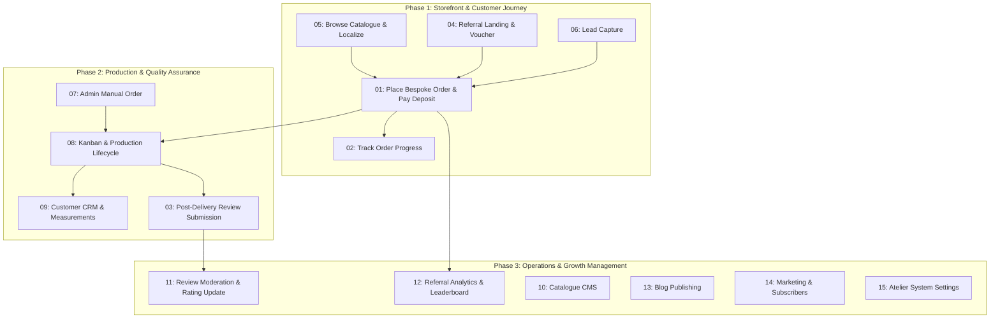

# Master Testing Flows & Use Cases Directory

This directory contains the comprehensive end-to-end specifications, use cases, and testing checklists for **CaptainStitches (Bespoke Nigerian Tailoring — Verona Atelier & Nigeria Workshop)**.

---

## 🧭 Flow Catalog

### 🛍️ Customer & Public Storefront Flows
1. [`01-customer-order-placement-flow.md`](file:///Users/danielnwokocha/Documents/projects/captain-stitches/manifesto/flows/01-customer-order-placement-flow.md)
   - *Scope:* All methods of placing an order (catalogue pre-fill, custom design upload, standard sizing vs bespoke measurement capture, referral voucher redemption, Stripe EUR / Paystack NGN 50% deposit checkout).
2. [`02-customer-order-tracking-flow.md`](file:///Users/danielnwokocha/Documents/projects/captain-stitches/manifesto/flows/02-customer-order-tracking-flow.md)
   - *Scope:* Unauthenticated live tracking by order number or phone number, stage visualizer, inspection photo viewing, estimated delivery, and direct WhatsApp tailor inquiry.
3. [`03-customer-review-and-rating-flow.md`](file:///Users/danielnwokocha/Documents/projects/captain-stitches/manifesto/flows/03-customer-review-and-rating-flow.md)
   - *Scope:* Post-delivery review submission from tracking page or direct link, editing existing reviews, photo uploads, star ratings, and moderation feedback.
4. [`04-customer-referral-and-invitation-flow.md`](file:///Users/danielnwokocha/Documents/projects/captain-stitches/manifesto/flows/04-customer-referral-and-invitation-flow.md)
   - *Scope:* Generating custom referral codes, visiting `/ref/[code]`, auto-activation of €10 / ₦10,000 welcome credit, referral conversion on checkout, and live patron rewards dashboard tracking.
5. [`05-customer-catalogue-and-discovery-flow.md`](file:///Users/danielnwokocha/Documents/projects/captain-stitches/manifesto/flows/05-customer-catalogue-and-discovery-flow.md)
   - *Scope:* Browsing collections by category, dual-language toggle (EN/IT), dual-currency switch (EUR/NGN), lookbook design details, and pre-filling the bespoke order builder.
6. [`06-customer-lead-capture-and-newsletter-flow.md`](file:///Users/danielnwokocha/Documents/projects/captain-stitches/manifesto/flows/06-customer-lead-capture-and-newsletter-flow.md)
   - *Scope:* Homepage discount incentive lead capture, checkout subscription opt-in, validation, duplicate handling, and subscriber synchronization.

---

### ⚙️ Admin Operations & Atelier Management Flows
7. [`07-admin-order-creation-flow.md`](file:///Users/danielnwokocha/Documents/projects/captain-stitches/manifesto/flows/07-admin-order-creation-flow.md)
   - *Scope:* Admin manual order creation for WhatsApp and walk-in clients, customer search or instant registration, measurement auto-population, custom surcharges, and deposit settings.
8. [`08-admin-order-production-and-inspection-lifecycle.md`](file:///Users/danielnwokocha/Documents/projects/captain-stitches/manifesto/flows/08-admin-order-production-and-inspection-lifecycle.md)
   - *Scope:* 7-stage state machine (`NEW` → `CONFIRMED` → `IN_PRODUCTION` → `INSPECTION` → `APPROVED` → `DISPATCHED` → `DELIVERED`), Kanban drag-and-drop, tailor assignment, inspection photo upload, quality sign-off gate, and balance invoice generation.
9. [`09-admin-customer-crm-and-measurements-flow.md`](file:///Users/danielnwokocha/Documents/projects/captain-stitches/manifesto/flows/09-admin-customer-crm-and-measurements-flow.md)
   - *Scope:* Customer profile management, 10-point jacket/trouser measurement updates, fit notes, past order history, admin internal notes, and one-click WhatsApp client contact.
10. [`10-admin-catalogue-and-inventory-management-flow.md`](file:///Users/danielnwokocha/Documents/projects/captain-stitches/manifesto/flows/10-admin-catalogue-and-inventory-management-flow.md)
    - *Scope:* CMS design creation, dual-language translation (EN/IT), dual-currency pricing, fabric/colour chips, photo gallery ordering, featured toggles, and visibility archival.
11. [`11-admin-review-moderation-flow.md`](file:///Users/danielnwokocha/Documents/projects/captain-stitches/manifesto/flows/11-admin-review-moderation-flow.md)
    - *Scope:* Review queue management, status approval/rejection, moderator notes, dynamic design star rating recalculation, and homepage testimonial feed update.
12. [`12-admin-referral-management-and-rewards-flow.md`](file:///Users/danielnwokocha/Documents/projects/captain-stitches/manifesto/flows/12-admin-referral-management-and-rewards-flow.md)
    - *Scope:* Conversion analytics, top referrers leaderboard, manual reward issuance, marking kickback rewards as redeemed against specific order numbers, and programme toggle (active/paused).
13. [`13-admin-blog-and-content-publishing-flow.md`](file:///Users/danielnwokocha/Documents/projects/captain-stitches/manifesto/flows/13-admin-blog-and-content-publishing-flow.md)
    - *Scope:* Authoring bilingual blog posts, SEO metadata, rich content/image management, draft/publish/schedule workflow, and public lookbook conversion CTAs.
14. [`14-admin-marketing-and-email-campaigns-flow.md`](file:///Users/danielnwokocha/Documents/projects/captain-stitches/manifesto/flows/14-admin-marketing-and-email-campaigns-flow.md)
    - *Scope:* Subscriber management, audience segmentation (Italy Diaspora, Nigeria Patrons, VIP), campaign broadcasting, and delivery analytics.
15. [`15-admin-settings-and-atelier-configuration-flow.md`](file:///Users/danielnwokocha/Documents/projects/captain-stitches/manifesto/flows/15-admin-settings-and-atelier-configuration-flow.md)
    - *Scope:* Business profile configuration, exchange rates, payment gateway API credentials, tailor role permissions, notification channel toggles, and dormant subscription tiers.

---

## 🎯 Recommended Testing Progression

